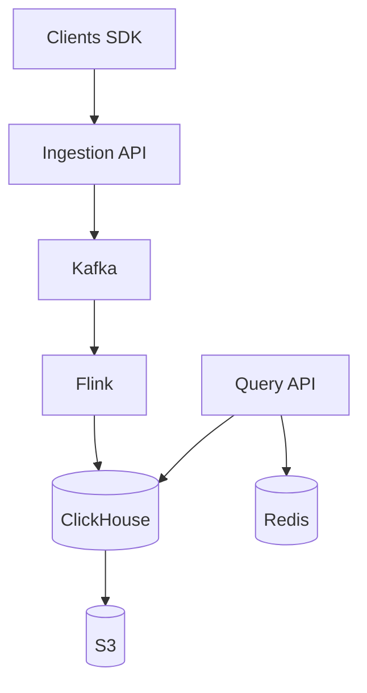

# Техническое решение: Сервис продуктовой аналитики

# 1. Постановка задачи

Необходимо спроектировать сервис продуктовой аналитики для веб- и мобильных приложений, а также для backend-сервисов. Система должна принимать поток событий от клиентских и серверных источников, валидировать их, сохранять сырые данные, строить агрегаты и предоставлять аналитические отчёты почти в реальном времени.

Ключевая цель решения — построить highload-архитектуру, которая:

- выдерживает высокий поток событий на запись;
- корректно работает с дубликатами;
- учитывает задержанные события;
- разделяет контур записи и контур аналитического чтения;
- остаётся расширяемой для новых типов событий и новых отчётов.

Примеры событий, которые должна поддерживать система:

- открытие страницы или экрана;
- просмотр карточки товара;
- использование поиска;
- добавление товара в корзину;
- начало оформления заказа;
- успешное создание заказа;
- регистрация пользователя;
- вход в аккаунт;
- клик по элементу интерфейса.

Система должна быть полезна для продуктовой аналитики: построения воронок, оценки конверсий, анализа активности пользователей, ретеншена, когорт и top-N отчётов по событиям.

---

# 2. Глоссарий

| Термин | Определение |
|---|---|
| Event | Событие о действии пользователя или системы |
| Producer | Источник событий: web, mobile или backend |
| Ingestion | Контур приёма событий в систему |
| Schema | Формат события, включающий обязательные и необязательные поля |
| Deduplication | Исключение повторного учёта одного и того же события |
| Aggregation | Расчёт метрик по множеству событий |
| Read Model | Представление данных, оптимизированное под быстрые аналитические запросы |
| Late Event | Событие, пришедшее позже времени его возникновения |
| Retention | Срок хранения данных |
| CQRS | Подход, при котором запись и чтение строятся разными потоками и хранилищами |
| Materialized View | Предрасчитанное представление данных для ускорения чтения |
| Eventual Consistency | Допустимая задержка между записью события и его появлением в аналитике |

---

# 3. Функциональные требования

## 3.1. Приём событий

Система должна обеспечивать приём событий от следующих источников:

- web frontend;
- mobile application;
- backend-сервисы.

Поддерживаемые варианты доставки:

- одиночная отправка события;
- пакетная отправка (batch).

Каждое событие должно содержать как минимум:

- `event_id`;
- `event_type`;
- `timestamp`;
- `user_id` или `device_id`;
- `properties`.

Желательно также поддерживать:

- `project_id` для изоляции данных;
- `platform` для различения web / iOS / Android / backend;
- `app_version`;
- `country` / `region`;
- `session_id`, если он доступен на стороне клиента.

## 3.2. Поддержка типов событий

Система должна поддерживать базовый набор событий:

- `page_view`;
- `search`;
- `add_to_cart`;
- `checkout_started`;
- `order_created`.

Архитектура должна позволять добавлять новые типы без полной переработки схемы и контура приёма.

## 3.3. Валидация событий

Система должна:

- проверять наличие обязательных полей;
- проверять базовую корректность формата;
- отклонять или изолировать некорректные события;
- не останавливать основной поток обработки из-за единичных ошибок;
- приводить события к единому внутреннему формату.

Некорректные события должны попадать в отдельный поток ошибок или quarantine, чтобы их можно было анализировать и исправлять без влияния на основную обработку.

## 3.4. Дедупликация

Система должна предотвращать двойной учёт одного и того же события.

Для этого используется:

- основной идентификатор `event_id`;
- дедупликация в stream processing;
- финальная защита на уровне хранилища.

Подход считается корректным, если повторная отправка того же события не приводит к двойному учёту в аналитике.

## 3.5. Хранение сырых событий

Система должна сохранять сырые события для:

- последующей аналитической обработки;
- переобработки за прошлые периоды;
- восстановления агрегатов при изменении логики расчётов;
- backfill исторических данных.

Хранение сырых событий должно быть отделено от агрегатов, чтобы можно было независимо пересчитывать витрины.

## 3.6. Построение агрегатов

Система должна уметь формировать как минимум следующие отчёты:

- количество событий по типам за период;
- число уникальных пользователей за день;
- воронку по шагам;
- топ страниц или экранов по количеству просмотров.

Воронка должна включать шаги:

1. просмотр товара;
2. добавление в корзину;
3. начало оформления заказа;
4. успешный заказ.

## 3.7. Запрос аналитики

Система должна предоставлять агрегированные данные через:

- API;
- аналитическую панель.

Должна поддерживаться фильтрация:

- по периоду времени;
- по типу события;
- по платформе;
- по стране или региону;
- по версии приложения.

## 3.8. Работа с задержанными событиями

Система должна учитывать, что часть событий может приходить с задержкой.

Необходимо предусмотреть:

- корректный учёт late events;
- пересчёт агрегатов в заданном временном окне;
- дозаполнение витрин;
- защиту от слишком старых backdated событий.

## 3.9. Политика хранения данных

Система должна поддерживать разные сроки хранения:

- для сырых событий;
- для агрегатов;
- для горячих и архивных данных.

Горячие данные должны быть доступны для быстрых запросов, архивные — для долгого хранения и переобработки.

---

# 4. Нефункциональные требования

## 4.1. Нагрузка

Система должна выдерживать:

- до 50 000 событий в секунду на запись в пике;
- всплески нагрузки во время маркетинговых кампаний, распродаж или релизов;
- постоянный высокий write load.

Характер нагрузки:

- запись — высокая и постоянная;
- чтение — реже, но аналитические запросы могут быть тяжёлыми.

## 4.2. Производительность

Требования к производительности:

- приём события не должен ждать завершения аналитической обработки;
- P95 latency для ingestion API — не более 100–200 мс;
- P95 latency для типовых аналитических запросов — не более 1–3 секунд.

Допускается near-real-time модель, а не строго мгновенная аналитика.

## 4.3. Надёжность

Система должна обеспечивать:

- отсутствие потери подтверждённых событий;
- устойчивость к отказу отдельных экземпляров сервисов;
- корректную работу при повторной доставке событий;
- корректную работу при временной недоступности части обработчиков;
- изоляцию некорректных данных от основного потока.

## 4.4. Консистентность

Для сырых событий важна надёжная запись.

Для аналитических витрин допускается eventual consistency: небольшая задержка между поступлением события и его отображением в отчётах.

## 4.5. Масштабируемость

Система должна горизонтально масштабироваться независимо по следующим контурам:

- приём событий;
- обработка и агрегация;
- хранение;
- чтение агрегатов.

Необходимо избегать архитектуры, где один компонент становится единственной точкой масштабирования и отказа.

## 4.6. Расширяемость

Система должна позволять:

- добавлять новые типы событий;
- добавлять новые агрегаты и отчёты;
- изменять и расширять схему события без полной переработки системы.

## 4.7. Эксплуатация

Система должна иметь средства мониторинга и наблюдаемости.

Необходимо предусмотреть метрики:

- входящий поток событий;
- число отклонённых или невалидных событий;
- число обнаруженных дубликатов;
- lag очередей;
- задержка обновления агрегатов;
- ошибки обработки.

Также должен быть механизм переобработки данных за период.

---

# 5. Архитектура решения

## 5.1. Краткое описание системы

Система проектируется как event-driven аналитическая платформа. В ней разделены:

- write path — приём и доставка событий;
- read path — аналитические запросы и построение отчётов.

Такая схема позволяет независимо масштабировать запись и чтение и снижать влияние тяжёлых аналитических запросов на ingestion.

## 5.2. Пользовательские и технические сценарии

### Сценарий 1. Отправка события

Пользовательское приложение собирает событие, добавляет `event_id`, отправляет его батчем или одиночно в Ingestion API. Сервис валидирует данные, проверяет дедупликацию и отправляет событие в Kafka.

### Сценарий 2. Построение аналитического отчёта

Пользователь открывает дашборд или вызывает API отчёта. Query API проверяет кэш, затем обращается к витрине в ClickHouse и возвращает агрегированный результат.

### Сценарий 3. Обработка задержанного события

Событие приходит позже фактического времени его возникновения. Система записывает его по `event_time`, а витрины пересчитываются в пределах поддерживаемого окна.

### Сценарий 4. Повторная доставка

Если клиент повторно отправляет то же событие с тем же `event_id`, система не учитывает его повторно в аналитике.

## 5.3. Границы системы и внешние источники событий

В систему входят:

- web SDK;
- mobile SDK;
- backend SDK;
- Ingestion API;
- stream processing;
- storage;
- Query API;
- dashboard.

В систему не входят:

- бизнес-логика клиентских приложений;
- CRM и внешние BI-системы;
- downstream ML-сервисы.

Внешние источники событий должны быть описаны как producers, но не должны зависеть от внутренней реализации аналитического хранилища.

## 5.4. Формат входного события и подход к эволюции схемы

Базовый формат события:

```json
{
  "event_id": "uuid-v7",
  "event_type": "page_view",
  "timestamp": "2026-05-19T12:00:00Z",
  "user_id": "123",
  "device_id": "device-1",
  "platform": "web",
  "app_version": "1.8.0",
  "properties": {
    "page_url": "/catalog",
    "referrer": "/home"
  }
}
```

Подход к эволюции схемы:

- обязательные поля остаются стабильными;
- дополнительные поля добавляются без breaking changes;
- новая версия схемы регистрируется в Schema Registry;
- валидация должна учитывать версию события;
- неизвестные свойства могут сохраняться в `properties`.

## 5.5. Архитектура приёма, доставки, обработки и хранения

Предлагаемая архитектура:



### Основные компоненты

| Компонент | Назначение |
|---|---|
| Ingestion API | Приём, проверка и публикация событий |
| Kafka | Буфер, транспорт и разгрузка write path |
| Flink | Stream processing, дедупликация, обогащение, sessionization |
| ClickHouse | Хранение сырых событий и агрегатов |
| Redis | Кэш аналитических запросов и счётчиков |
| Query API | Выполнение аналитических запросов |
| S3 | Архив сырых событий и выгрузки |

### Принцип работы

1. Клиент отправляет событие в Ingestion API.
2. Ingestion API валидирует данные и пишет их в Kafka.
3. Stream processing читает поток, выполняет дедупликацию и базовое обогащение.
4. Обработанные данные записываются в ClickHouse.
5. Query API читает данные из агрегатов и кеша.

## 5.6. Подход к дедупликации

Дедупликация выполняется в два слоя:

### Первый слой: stream-side deduplication

Flink хранит state по ключу `(project_id, event_id)` и отбрасывает повторяющиеся события в пределах TTL-окна.

### Второй слой: storage-level protection

ClickHouse использует `ReplacingMergeTree`, чтобы финально схлопывать дубли при фоновых merge-операциях.

Такой подход защищает систему как от быстрых повторных отправок, так и от поздних дублей.

## 5.7. Подход к обработке late events

Late events должны учитывать `event_time`, а не только `ingest_time`.

Подход:

- событие попадает в ту временную партицию, которая соответствует времени возникновения;
- при поступлении late event пересчитываются затронутые витрины;
- для последних 7 дней используется открытое окно пересчёта;
- события старше допустимого окна могут игнорироваться или попадать в отдельную метрику.

Это позволяет сохранить корректность аналитики без полного пересчёта всех исторических данных.

## 5.8. Модель хранения сырых событий и агрегатов

### Raw events

Сырые события хранятся в ClickHouse и архивируются в S3.

Основные свойства модели:

- партиционирование по времени;
- сортировка по `project_id`, `event_type`, `event_time`;
- возможность выборки по проекту, периоду и типу события.

### Aggregates

Агрегаты строятся отдельно от raw events.

Используются:

- materialized views;
- precomputed read models;
- Redis cache для горячих запросов;
- периодические пересчёты для window-based метрик.

### Хранение по слоям

- hot layer — быстрые запросы по недавним данным;
- warm layer — исторические аналитические запросы;
- cold layer — архив и долговременное хранение.

## 5.9. Модель данных (Data Model)

| Сущность | Хранилище | Назначение | Ключевые поля |
|---|---|---|---|
| `events` | ClickHouse | Сырые события | `project_id`, `event_id`, `event_type`, `event_time`, `distinct_id`, `properties` |
| `aggregates_daily` | ClickHouse | Суточные агрегаты | `project_id`, `date`, `event_type`, `count`, `unique_users` |
| `funnels` | ClickHouse / MV | Воронки по шагам | `project_id`, `funnel_id`, `step`, `converted_users`, `conversion_rate` |
| `retention` | ClickHouse / MV | Retention-метрики | `project_id`, `cohort_date`, `day_n`, `retained_users` |
| `cohort_members` | ClickHouse | Состав когорты | `project_id`, `cohort_id`, `distinct_id`, `computed_at` |
| `query_cache` | Redis | Кэш аналитических запросов | `query_hash`, `result`, `ttl` |
| `identity_map` | Cassandra | Маппинг идентичностей | `project_id`, `distinct_id`, `canonical_id` |
| `schemas` | PostgreSQL | Реестр схем | `project_id`, `event_name`, `version`, `properties_schema` |
| `projects` | PostgreSQL | Метаданные проекта | `id`, `name`, `slug`, `created_at` |
| `alerts` | PostgreSQL | Правила алертов | `project_id`, `rule`, `channel`, `status` |

## 5.10. Способ построения аналитических витрин

Витрины строятся как предрасчитанные модели под типовые отчёты.

Примеры витрин:

- daily events by type;
- unique users per day;
- funnels;
- retention;
- top pages;
- cohorts.

Обновление витрин:

- инкрементальное для свежих данных;
- периодическое для оконных расчётов;
- пересчёт при приходе late events.

Это уменьшает нагрузку на запросы и ускоряет работу аналитической панели.

## 5.11. Подход к масштабированию и обеспечению отказоустойчивости

### Масштабирование

Система масштабируется отдельно по каждому контуру:

- Ingestion API — stateless и горизонтально масштабируется;
- Kafka — за счёт partitions и broker replication;
- Flink — за счёт параллелизма обработчиков;
- ClickHouse — за счёт шардирования;
- Redis — за счёт Redis Cluster.

### Отказоустойчивость

Используются следующие меры:

- репликация Kafka;
- репликация ClickHouse;
- retry с backoff на клиенте;
- graceful degradation при временной недоступности части витрин;
- изоляция некорректных событий от основного потока.

Если часть хранилища недоступна, система должна продолжать принимать события и не терять уже подтверждённые данные.

## 5.12. Основные компромиссы выбранного решения

| Решение                        | Компромисс                                                       |
| ------------------------------ | ---------------------------------------------------------------- |
| Kafka как буфер                | Усложнение инфраструктуры, но выше надёжность и throughput       |
| Eventual consistency           | Отчёты появляются с задержкой, зато ingestion не блокируется     |
| Materialized views             | Возможна кратковременная устарелость витрин                      |
| Дедупликация в несколько слоёв | Сложнее реализация, но лучше защита от дублей                    |
| ClickHouse для аналитики       | Отлично подходит для чтения, но требует аккуратной модели данных |
| Separate write/read path       | Сложнее эксплуатация, но лучше SLA и масштабирование             |
