# Техническое решение: Сервис продуктовой аналитики

## 1. Введение

Документ описывает техническое решение внутреннего сервиса **продуктовой аналитики** — системы для сбора, обработки, хранения и анализа поведенческих событий пользователей цифровых продуктов компании.

Сервис покрывает функциональные потребности продуктовых команд: построение воронок конверсии, retention-анализ, когортный анализ, сегментацию, A/B-тесты, real-time дашборды.

**Особенности предметной области, определяющие архитектуру:**

- **Очень высокий write-throughput**: миллионы событий в секунду в пике.
- **Резкая асимметрия чтение/запись**: операций записи на порядки больше, чем запросов.
- **Аналитическая природа запросов**: агрегации по времени, окнам, последовательностям событий — не row-lookup.
- **Near-real-time, а не real-time**: продуктовый дашборд может допускать задержку 30 сек – 5 мин.
- **Мультитенантность**: десятки тысяч проектов на одном кластере с изоляцией данных и нагрузки.
- **Late-arriving events**: события с мобильных могут приходить с задержкой в дни.

## 2. Глоссарий

| Термин                  | Определение                                                                                                    |
| ----------------------- | -------------------------------------------------------------------------------------------------------------- |
| **Event (Событие)**     | Атомарный факт действия пользователя с типом и набором свойств. Пример: `button_click {button_id: "checkout"}` |
| **Event Name / Type**   | Тип события (`page_view`, `purchase`, `signup`, …)                                                             |
| **Property**            | Свойство события (event property) или пользователя (user property)                                             |
| **Distinct ID**         | Идентификатор пользователя в аналитике: `anonymous_id` до авторизации или `user_id` после                      |
| **Identity Merge**      | Связывание `anonymous_id` с `user_id` после авторизации                                                        |
| **Session**             | Логическая группа событий одного пользователя в пределах окна неактивности                                     |
| **Project (Workspace)** | Изолированное пространство данных одного продукта; тенант системы                                              |
| **Funnel (Воронка)**    | Последовательность событий с расчётом конверсии по шагам в заданном временном окне                             |
| **Cohort (Когорта)**    | Множество пользователей, удовлетворяющих критериям (события, свойства)                                         |
| **Retention**           | Доля пользователей когорты, вернувшихся в продукт через N дней                                                 |
| **Read Model**          | Предрассчитанное представление данных, оптимизированное под чтение                                             |
| **Materialized View**   | Материализованное представление в ClickHouse, обновляемое инкрементально                                       |
| **Ingestion**           | Процесс приёма, валидации и постановки события в обработку                                                     |
| **Backfill**            | Дозагрузка исторических данных                                                                                 |
| **Late event**          | Событие, пришедшее с задержкой относительно `event_time`                                                       |
| **SDK**                 | Клиентская библиотека для отправки событий                                                                     |
| **At-least-once**       | Гарантия доставки сообщения как минимум один раз (возможны дубли)                                              |
| **Idempotency**         | Свойство, при котором повторное событие учитывается не более одного раза (ключ — `event_id`)                   |
| **CQRS**                | Command Query Responsibility Segregation — разделение путей записи и чтения                                    |
| **DAU / MAU**           | Daily / Monthly Active Users — уникальные пользователи за день / месяц                                         |

## 3. Функциональные требования

### 3.1. Сбор событий

| ID   | Требование                                                                                        |
| ---- | ------------------------------------------------------------------------------------------------- |
| ФТ-1 | Приём событий через HTTPS API: одиночное и батчевое                                               |
| ФТ-2 | SDK для web (JS), iOS, Android, server-side (Go, Python, Node) с локальным буфером и ретраями     |
| ФТ-3 | Авторизация по API-ключу проекта; раздельные ключи на ingest и query                              |
| ФТ-4 | Валидация структуры события (обязательные поля: `event`, `distinct_id`, `timestamp`, `event_id`)  |
| ФТ-5 | Серверное обогащение: `ip → country/region/city`, `user_agent → device/os/browser`, `server_time` |

### 3.2. Идентификация

| ID | Требование |
|---|---|
| ФТ-6 | Поддержка анонимных пользователей (`anonymous_id` генерируется SDK) |
| ФТ-7 | Merge `anonymous_id → user_id` после авторизации через служебное событие `$identify` |
| ФТ-8 | User properties: операции `set`, `set_once`, `add`, `unset` |

### 3.3. Аналитика

| ID | Требование |
|---|---|
| ФТ-9  | Воронки: задание последовательности шагов, окна конверсии, breakdown по свойствам |
| ФТ-10 | Retention: N-day / weekly / monthly retention, по когортам и сегментам |
| ФТ-11 | Когорты: создание по критериям «совершил/не совершил событие», «свойство равно/не равно», агрегаты |
| ФТ-12 | Сегментация: фильтрация любых графиков по свойствам и принадлежности к когорте |
| ФТ-13 | Trends / Insights: графики числа событий и уникальных пользователей с разбивкой |
| ФТ-14 | Path analysis: типичные последовательности действий до/после ключевого события |
| ФТ-15 | Real-time view: последние ~30 секунд событий, обновление потоком |

### 3.4. Управление

| ID | Требование |
|---|---|
| ФТ-16 | Проекты, команды, роли (Owner / Admin / Analyst / Viewer) |
| ФТ-17 | Дашборды и сохранённые отчёты |
| ФТ-18 | Алерты на метрики (`conversion drop > 20%` и т. п.) с доставкой в Slack / Email / Webhook |
| ФТ-19 | Экспорт сырых событий в S3 (Parquet) и BigQuery / Snowflake |
| ФТ-20 | Schema Registry: автоматическая регистрация типов событий и свойств с отображением в UI |
| ФТ-21 | GDPR-удаление: API «удалить все данные пользователя» с подтверждением в audit log |

## 4. Нефункциональные требования

### 4.1. Нагрузка и производительность

| ID   | Требование                                                                                                |
| ---- | --------------------------------------------------------------------------------------------------------- |
| НТ-1 | Пиковая нагрузка ingestion: **100000 events/sec**, среднесуточная — 10000 events/sec                      |
| НТ-2 | Размер события: ~500 B в среднем, до 32 KB максимум                                                       |
| НТ-3 | Latency ingestion: p99 ≤ **200 мс** (от запроса клиента до 200 OK)                                        |
| НТ-4 | Latency query: p95 ≤ **5 сек** на горячем периоде (7 дней), p95 ≤ **30 сек** на полном горизонте (13 мес) |
| НТ-5 | Время от события до появления в real-time view: ≤ **30 сек p95**                                          |
| НТ-6 | Время от события до агрегатов на дашбордах: ≤ **5 мин p95**                                               |

### 4.2. Доступность

| ID | Требование |
|---|---|
| НТ-7 | Ingestion API: **99.95%** месячная доступность (≈ 22 мин/мес) |
| НТ-8 | Query API: 99.9% |
| НТ-9 | Graceful degradation: при недоступности части шардов — `partial=true` ответ, ingestion продолжает работать |

### 4.3. Хранение

| ID    | Требование                                                                     |     |
| ----- | ------------------------------------------------------------------------------ | --- |
| НТ-10 | Hot storage: 12 месяцев событий в ClickHouse (SSD)                             |     |
| НТ-11 | Cold storage: бессрочно в S3 (Parquet) с возможностью query через Athena/Trino |     |
| НТ-12 | Объём: ~10 PB сырых данных в горизонте, ~2 PB после компрессии                 |     |

### 4.4. Согласованность и надёжность

| ID | Требование |
|---|---|
| НТ-13 | Доставка: **at-least-once** с дедупликацией по `(project_id, event_id)` |
| НТ-14 | Идемпотентность ingestion: повторная отправка с тем же `event_id` не создаёт дубль |
| НТ-15 | Eventual consistency между ingestion и query: ≤ 30 сек (real-time), ≤ 5 мин (дашборды) |
| НТ-16 | Durability: подтверждение 200 OK только после `acks=all` в Kafka |

### 4.5. Безопасность и приватность

| ID | Требование |
|---|---|
| НТ-17 | TLS 1.2+ для всех внешних соединений |
| НТ-18 | Ротация API-ключей, отдельные ключи на ingest и query |
| НТ-19 | GDPR-удаление в течение 30 дней с момента запроса |
| НТ-20 | Мультитенантная изоляция: запрос проекта P не может получить данные проекта P' |

### 4.6. Архитектурные принципы и ограничения

| ID | Принцип | Обоснование |
|---|---|---|
| АП-1 | **CQRS**: write-path и read-path разделены по компонентам и хранилищам | Записи и чтения имеют разные SLA, объёмы и паттерны — общий путь стал бы bottleneck для обоих |
| АП-2 | **Event-driven через Kafka** | Развязка ingestion и обработки; replay; буфер при сбоях downstream |
| АП-3 | **Шардирование по `project_id`** | Естественная граница тенанта и параллелизма; запросы всегда содержат `project_id` |
| АП-4 | **Stateless ingestion** | Горизонтальное масштабирование без sticky-сессий |
| АП-5 | **Idempotency-first**: каждое событие имеет `event_id` (UUID v7) | Делает безопасными ретраи на любом уровне |
| АП-6 | **Backpressure**: переполнение → 503 с `Retry-After`, не падение | SDK ретраит из локального буфера, события не теряются |
| АП-7 | **Read models** для типовых запросов | Снимает нагрузку с CH на повторных запросах |
| АП-8 | **Polyglot persistence**: ClickHouse / PostgreSQL / Cassandra / Redis | Каждый store решает свою задачу; нет компромисса «универсальная БД» |
| АП-9 | **Без сложной координации между шардами** | Все аналитические запросы — внутри одного `project_id` и его шарда |

## 5. Пользовательские сценарии

### 5.1. UC-1. Интеграция SDK

Разработчик инициализирует SDK с API-ключом. SDK генерирует `anonymous_id`, сохраняет в local storage / KeyChain. При действиях пользователя — добавляет события в буфер; отправляет батчами по таймеру (5 сек) или порогу размера (50 событий). При офлайне — копит локально (persistent на мобильных), отправляет при восстановлении. Каждому событию назначается `event_id` (UUID v7) — гарантия идемпотентности на ретраях.

### 5.2. UC-2. Авторизация пользователя

После логина клиент вызывает `analytics.identify(user_id)`. SDK отправляет служебное событие `$identify` со связкой `anonymous_id → user_id`. Identity Service пишет в маппинг. Будущие запросы по `user_id` видят и прошлые события под `anonymous_id`.

### 5.3. UC-3. PM строит воронку

Product manager в UI создаёт funnel из шагов `page_view{url:/landing} → signup → purchase`, окно конверсии 7 дней, период — последние 30 дней.

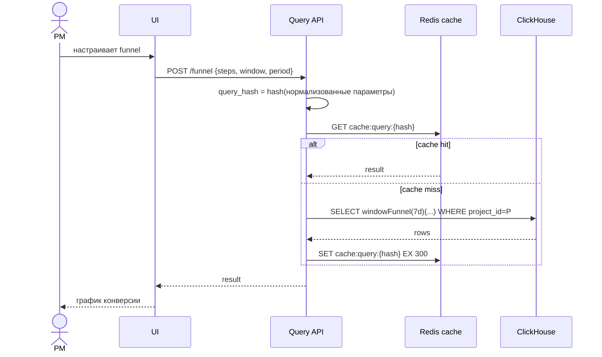

### 5.4. UC-4. Аналитик создаёт когорту

Аналитик задаёт критерий «совершил `purchase` ≥ 2 раз за последние 30 дней». Cohort Service помещает определение в PostgreSQL, ставит задачу в очередь. Воркер транслирует критерий в SQL, считает в ClickHouse, пишет результат в `cohort_members`. После завершения когорту можно использовать как фильтр в любом графике.

### 5.5. UC-5. Маркетолог настраивает алерт

Маркетолог задаёт правило: «если дневная конверсия `add_to_cart → purchase` упала ниже 5% — Slack». Alert Service хранит правило; раз в 5 мин пересчитывает метрику через Query API; при срабатывании публикует в notification-канал. Учитывается hysteresis (3 интервала подряд), чтобы не флапало.

### 5.6. UC-6. GDPR-запрос на удаление

DPO компании-клиента отправляет запрос «удалить данные пользователя `user_id=U` в проекте `P`». Сервис принимает заявку, ставит её в deletion-queue с deadline +30 дней, асинхронно стирает события (`ALTER TABLE ... DELETE`), user properties, identity-маппинг, members когорт; в audit log пишет подтверждение.

## 6. Модель данных

### 6.1. Распределение по хранилищам

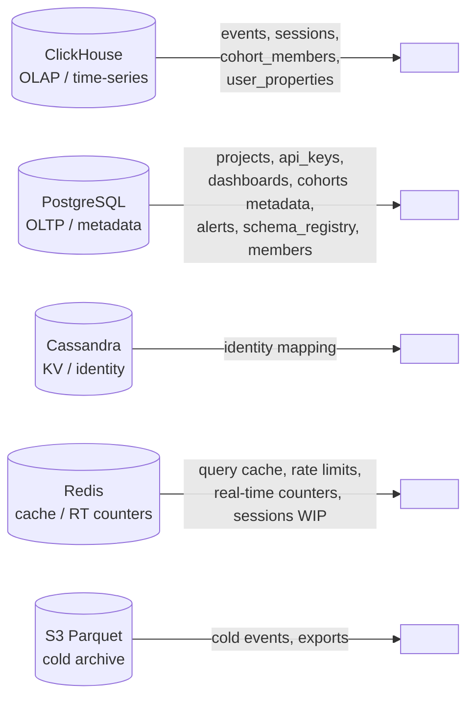

**Принцип**: каждый store отвечает за тип нагрузки, на который он оптимизирован.

### 6.2. Схема ClickHouse (горячие данные событий)

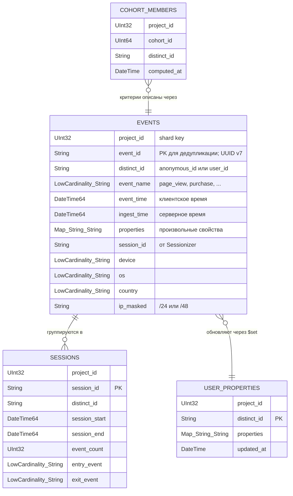

**Конфигурация таблицы `EVENTS`:**

```
ENGINE = ReplicatedReplacingMergeTree(ingest_time)
PARTITION BY toYYYYMM(event_time)
ORDER BY (project_id, event_name, distinct_id, event_time)
PRIMARY KEY (project_id, event_name)
SETTINGS index_granularity = 8192
TTL event_time + INTERVAL 13 MONTH TO VOLUME 'cold_s3'
```

- `ReplacingMergeTree` по `event_id` → финальная защита от дублей в горизонте партиции
- `ORDER BY` оптимизирован под типовые запросы: фильтр по `event_name` + `project_id` + диапазон времени
- Sharding key: `cityHash64(project_id)` — события одного проекта в одном шарде
- TTL: автоматический move в S3-backed disk через 13 месяцев

### 6.3. Схема PostgreSQL (метаданные)

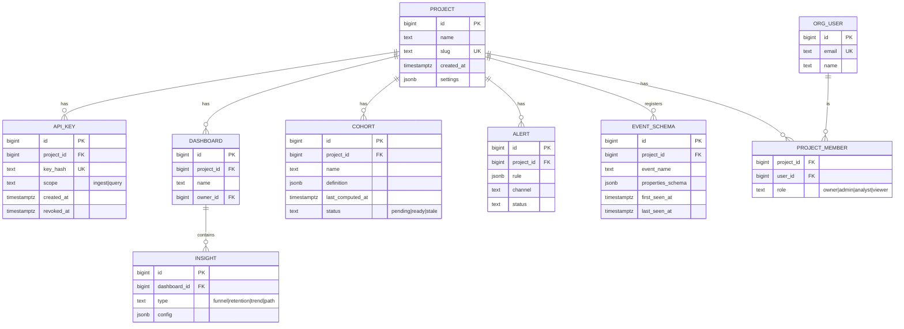

Объём PG умеренный (метаданные), шардирование не требуется: primary + 2 read-replica.

### 6.4. Схема Cassandra / ScyllaDB (identity mapping)

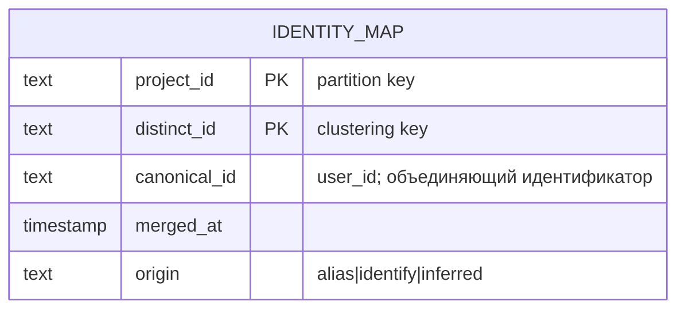

- Partition key: `project_id` — изоляция и распределение
- Clustering key: `distinct_id` — O(1) lookup по `(project_id, distinct_id)`
- Запись маленькая, чтения частые и точечные — идеальный fit для wide-column store
- TTL не задаётся: identity не истекает

### 6.5. Схема Redis (cache + real-time)

| Ключ | Тип | Назначение | TTL |
|---|---|---|---|
| `cache:query:{hash}` | String (JSON) | Кэш результата query | 5 мин |
| `rt:dau:{project_id}:{date}` | HyperLogLog | Real-time DAU | до 23:59 UTC |
| `rt:events:{project_id}:{minute}` | Counter | Real-time events per minute | 1 час |
| `rl:ingest:{api_key}` | Sorted Set | Sliding window rate limiter | 1 мин |
| `sess:wip:{project_id}:{distinct_id}` | Hash | Открытая сессия (буфер для Sessionizer) | 30 мин с момента последнего события |
| `identity:hot:{project_id}:{distinct_id}` | String | LRU-кэш identity (горячие) | 10 мин |

### 6.6. Соответствие модели данных сценариям

| Сценарий | Используемые сущности | Ключевая операция |
|---|---|---|
| UC-3 (воронка) | `EVENTS` + `cache:query:*` | `windowFunnel()` в CH; primary key `(project_id, event_name, …)` минимизирует чтение |
| UC-4 (когорта) | `COHORT` (PG) + `COHORT_MEMBERS` (CH) | Асинхронный пересчёт; результат — JOIN-фильтр в графиках |
| UC-2 (identity merge) | `IDENTITY_MAP` (Cassandra) + `$identify`-event в `EVENTS` | Lookup всех алиасов → `distinct_id IN (...)` |
| UC-5 (alert) | `ALERT` (PG) + Query API | Периодический пересчёт |
| ФТ-21 / UC-6 (GDPR) | `ALTER TABLE EVENTS DELETE WHERE` + удаление из всех других store | Асинхронная мутация |

## 7. Архитектура системы

### 7.1. Общая схема

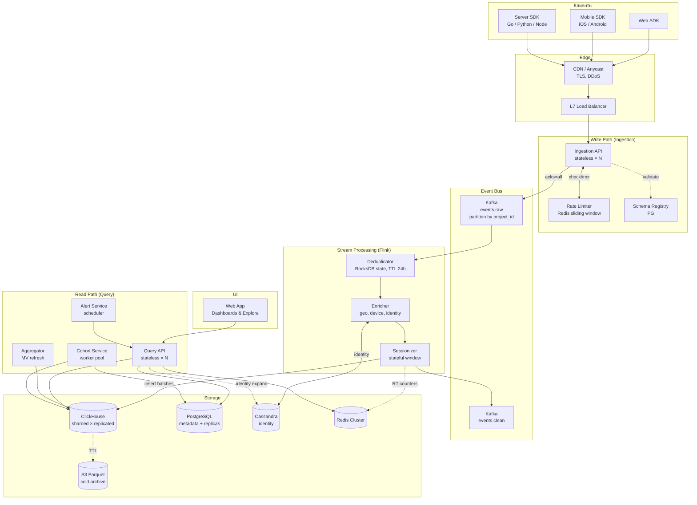

### 7.2. Зоны ответственности

| Компонент | Ответственность | Stateful | Масштабирование |
|---|---|---|---|
| **SDK** | Сбор, локальный буфер, ретраи, `anonymous_id`, `event_id` | local | n/a |
| **CDN / Anycast** | TLS terminate, гео-близость, защита от L3/L4 DDoS | нет | автомасштабирование провайдера |
| **Ingestion API** | Авторизация по API-key, валидация схемы, обогащение (`server_time`, `geo`, `ua`), публикация в Kafka | нет | горизонтально (HPA по RPS) |
| **Rate Limiter** | Лимиты per API-key (sliding window в Redis) | да (Redis) | Redis Cluster, шарды по ключу |
| **Schema Registry** | Регистрация типов событий и свойств, version-aware валидация | да (PG) | реплики PG, кэш в Ingestion |
| **Kafka** | Буфер, развязка, replay, упорядоченность по партиции | да | partitions по hash(`project_id`); brokers ≥ 9 |
| **Deduplicator** | Откидывание `(project_id, event_id)`-дублей в окне 24 ч | да (RocksDB) | по партициям Kafka |
| **Enricher** | Identity lookup, geo, device parsing | частично | stateless логика; Cassandra-кэш в Redis |
| **Sessionizer** | Stateful окна сессий по `distinct_id` | да | partition by `distinct_id` |
| **ClickHouse** | OLAP-хранилище событий | да | sharded (по `project_id`) × replicated |
| **PostgreSQL** | Метаданные (низкий QPS, маленький объём) | да | primary + 2 replica |
| **Cassandra** | Identity mapping (высокий QPS, миллиарды записей) | да | partition by `project_id` |
| **Redis Cluster** | Cache, RT-счётчики, rate limit, identity hot-cache | да | sharded |
| **Query API** | Парсинг DSL, кэш, маршрутизация в CH / MV / read-models, авторизация | нет | горизонтально |
| **Aggregator** | Refresh materialized views, recompute read models | да (jobs) | по `project_id` |
| **Cohort Service** | Расчёт когорт (on-demand + cron hourly) | да (queue) | worker pool, partition by `project_id` |
| **Alert Service** | Периодическая проверка правил | да (scheduler) | по `project_id` |
| **Web App** | UI, аутентификация пользователей системы | нет | за CDN |

### 7.3. Границы синхронной и асинхронной обработки

**Синхронно** (клиент ждёт ответа):
- `SDK → Ingestion API`: только до публикации в Kafka. `200 OK` означает «принято в буфер». **Этот SLA — самый строгий: p99 ≤ 200 мс.**
- `UI → Query API`: пользователь ждёт ответ. SLA p95 ≤ 5 сек на горячем периоде.

**Асинхронно** (через очередь / pull):
- `Kafka → Stream Processing → ClickHouse`: вся тяжёлая обработка вне критического пути ingestion.
- `Cohort recompute`: задача в очередь, ответ `202 Accepted`, статус опрашивается.
- `Alert evaluation`: scheduler.
- `Identity merge`: эффект на запросы отложен (≤ 1 мин через RT-обновление Cassandra-кэша).
- `GDPR delete`: SLA 30 дней.

**Обоснование границы.** Если бы клиент ждал записи в ClickHouse, любое замедление CH (compaction, тяжёлый запрос соседнего проекта, replication lag) ронял бы ingestion. Kafka даёт buffer на часы при p99 200 мс производства — это инженерное решение, переносящее edge-cases с горячего пути на холодный.

### 7.4. Принципы CQRS в этой архитектуре

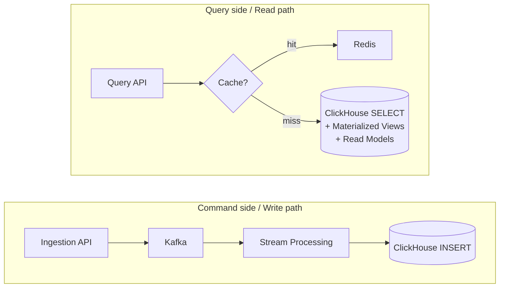

- Записи и чтения **никогда не делят критический путь**: даже при тяжёлом запросе на CH ingestion продолжает писать в Kafka.
- У записей и чтений **разные SLA**, разные паттерны, и поэтому разные оптимизации (для записи — пропускная способность, для чтения — латентность по конкретным шаблонам).
- Read models — отдельная оптимизация чтения, не влияющая на запись.

### 7.5. Шардирование

**Ключ шардирования — `project_id`.**

Обоснование:
- Все аналитические запросы содержат `project_id` (естественная граница тенанта).
- Не требуется cross-shard join: воронки, retention, когорты — внутри одного проекта.
- Изоляция: тяжёлый запрос проекта `A` не нагружает шард с проектами `B`, `C`.

Что делать с «горячими» проектами:
- Мониторинг распределения объёма по шардам.
- Крупные проекты выносятся на **dedicated shards** (вручную, через переселение партиций).
- Для очень крупных — возможно дополнительное под-шардирование по `cityHash64(distinct_id) % K` внутри проекта (на этапе MVP — не требуется).

## 8. Технические сценарии

### 8.1. ТС-1. Приём события (happy path)

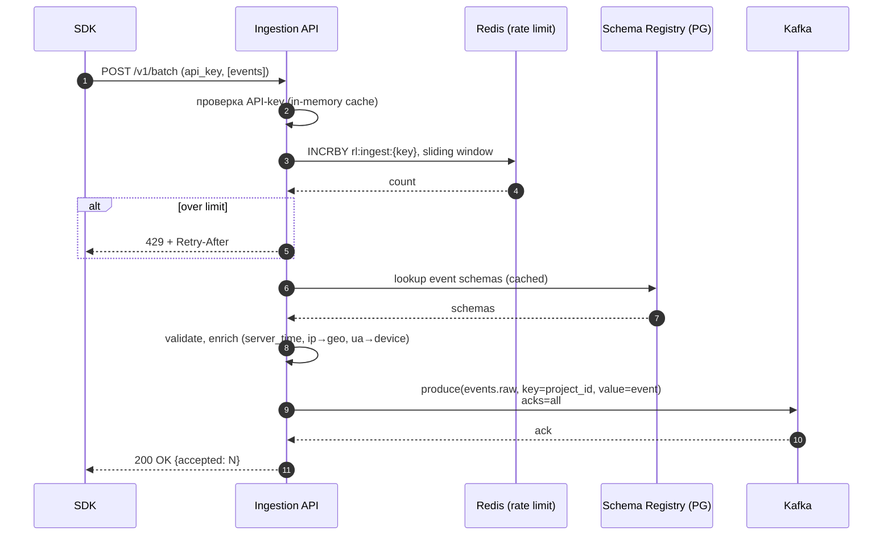

Ключевые свойства:
- `acks=all` — событие подтверждается только после записи во все ISR-реплики Kafka (durability).
- Идемпотентность: SDK ставит `event_id`, ingestion прокидывает; ретрай SDK не приведёт к дублю (его уберёт Deduplicator).
- Кэширование API-key и схем в памяти Ingestion с TTL 1 мин — отсекает чтения из PG на горячем пути.

### 8.2. ТС-2. Backpressure при пиках и сбоях downstream

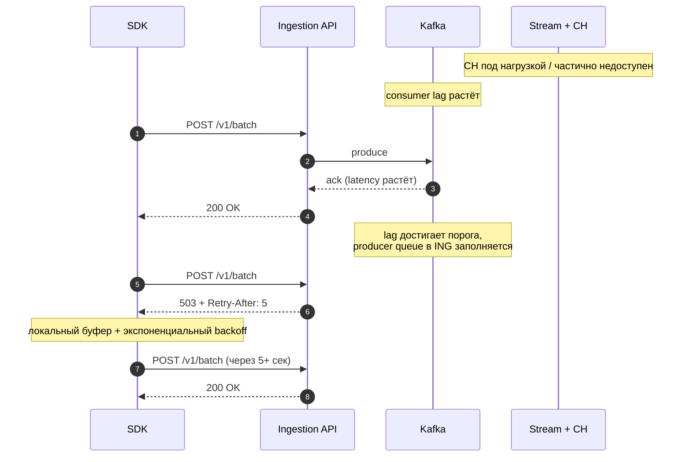

- Kafka retention 72 ч — даёт большой буфер при просадке Stream/CH.
- SDK имеет persistent-буфер (мобильные) или sessionStorage (web) — события переживают перезагрузку.
- `429` (over-quota) и `503` (downstream-проблема) разделены: разная политика ретрая у SDK.

### 8.3. ТС-3. Дедупликация (идемпотентность по `event_id`)

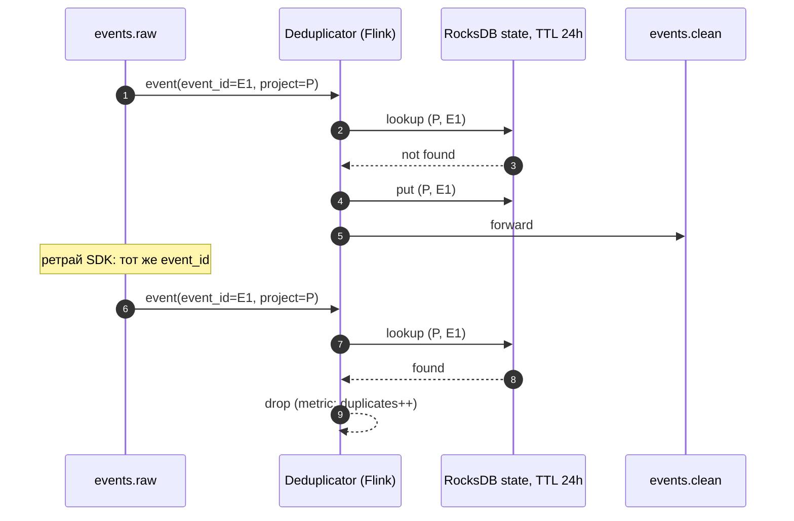

- Окно state 24 ч — баланс между памятью (TBs RocksDB) и реальным окном ретраев.
- Финальная защита от late-дублей вне окна — `ReplacingMergeTree` в CH (мерж по `event_id` фоном; `FINAL` при критичных запросах).

### 8.4. ТС-4. Identity Merge

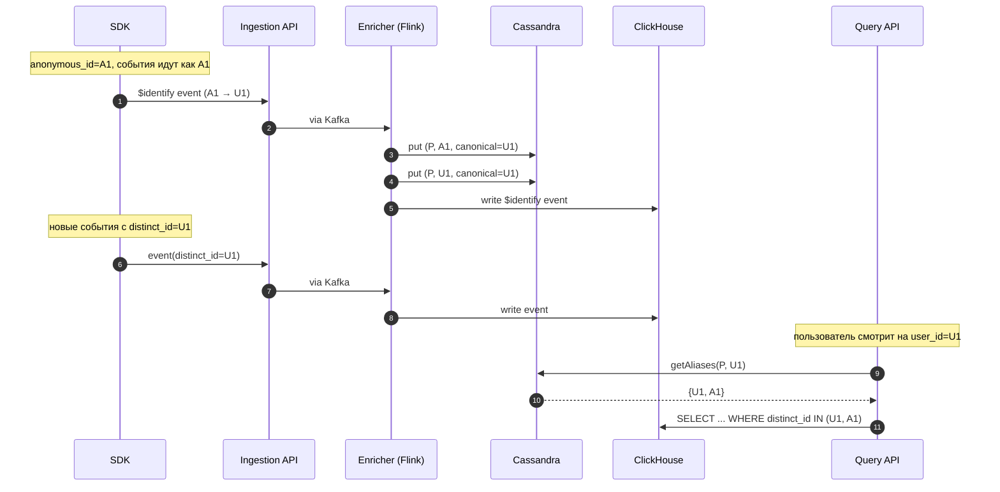

**Решение для исторических данных.** При merge не переписываем миллиарды старых событий с `A1` на `U1`: вместо этого Query API **расширяет** условие `distinct_id` через lookup в Cassandra. Альтернатива (отвергнута): bulk-rewrite в CH — слишком дорого и хрупко.

**Кэш.** Горячие алиасы держатся в Redis (`identity:hot:*`), TTL 10 мин.

### 8.5. ТС-5. Запрос воронки (read-path с кэшем)

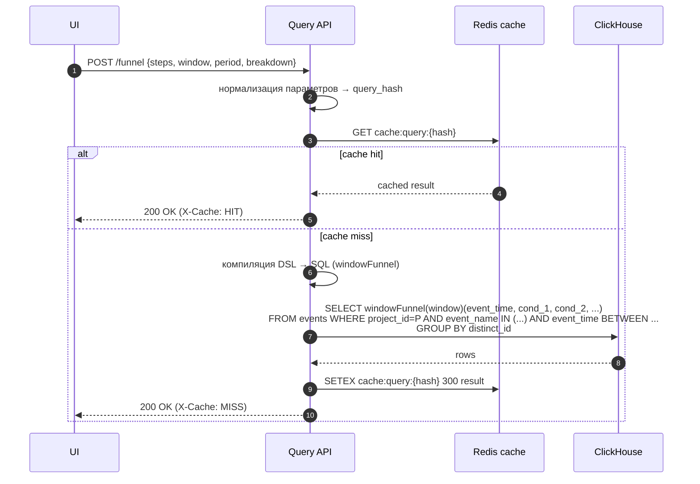

Оптимизации запроса:
- Фильтр `project_id=P` → router в CH идёт на нужный шард.
- `event_name IN (steps)` → primary key, минимум прочитанных данных.
- `windowFunnel()` — нативная функция, один проход.
- Кэш на 5 мин — компромисс «свежесть vs нагрузка»; для дашбордов с auto-refresh приемлемо.

### 8.6. ТС-6. Расчёт когорты

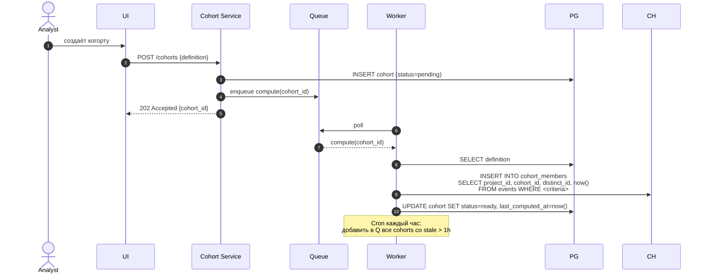

Идемпотентность пересчёта: в `cohort_members` есть `cohort_id` + ReplacingMergeTree по `(project_id, cohort_id, distinct_id)` с `computed_at`; повтор INSERT перетирает старое.

### 8.7. ТС-7. Отказ узла ClickHouse

Конфигурация: `ReplicatedMergeTree`, на каждом шарде ≥ 2 реплики, координация через ClickHouse Keeper (3 узла, quorum).

**Сценарии:**

| Тип отказа | Поведение системы |
|---|---|
| Одна реплика шарда | Запросы автоматически → оставшиеся реплики; запись копится в очереди репликации; после recovery — догоняет |
| Все реплики одного шарда | Данные шарда временно недоступны; Query API возвращает `partial=true` + `missing_shards`; ingestion продолжает писать в Kafka — после recovery воспроизводит из Kafka |
| Split-brain Keeper | Запись возможна только при наличии quorum (2 из 3) |
| Полный регион | Multi-AZ deployment; failover на другой регион вручную (минуты); Kafka MirrorMaker реплицирует события |

### 8.8. ТС-8. GDPR-удаление

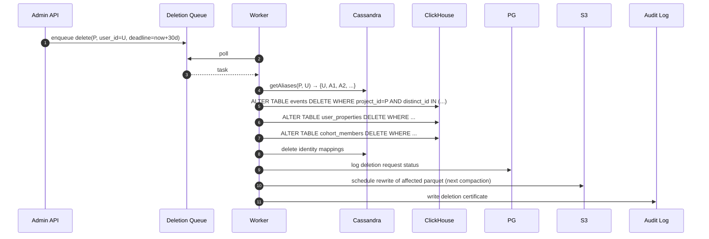

CH-мутация асинхронная (минуты – часы для крупного проекта), но укладывается в SLA 30 дней.

### 8.9. ТС-9. Late-arriving events

Событие пришло через 7 дней (мобильный был офлайн):

1. В Kafka: `event_time = T-7d`, `ingest_time = now`.
2. Записывается в партицию `toYYYYMM(event_time)` — может оказаться в **прошлой** месячной партиции.
3. Дашборды с TTL 5 мин подхватят его при следующем пересчёте.
4. **Read models** для дневных агрегатов держат **«открытое окно» последних 7 дней** — пересчитывают эти дни ночью.
5. События старше **30 дней** игнорируются (метрика `late_drop`) — защита от деградации исторических агрегатов и атаки backdated events.

### 8.10. ТС-10. Регистрация новой схемы события (Schema Registry)

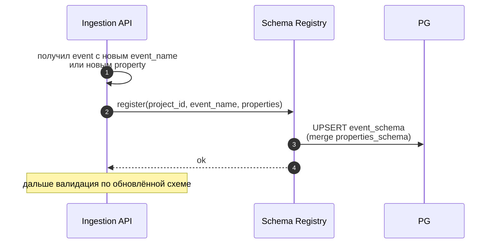

Schema discovery — лениво, on-demand. UI читает `event_schema` из PG и показывает available events / properties в конструкторе графиков.

## 9. Highload-аспекты: сводка решений

| Проблема | Решение | Trade-off |
|---|---|---|
| **Bottleneck на запись в CH** | Буфер Kafka + batch INSERT (10 сек / 100K строк / 100 MB — что раньше) | Eventual consistency: 30 сек – 5 мин |
| **Bottleneck на тяжёлые запросы** | Read models + Redis cache + materialized views | Stale data в кэше до 5 мин |
| **Read/write asymmetry** | CQRS: разные хранилища, разные пути | Сложнее эксплуатация и схема в нескольких местах |
| **Конкуренция за CPU CH между тенантами** | Шардирование по `project_id`, `max_concurrent_queries_for_user`, dedicated shards для крупных | Не вся ёмкость кластера видна одному проекту |
| **Скачки нагрузки** | Rate limiting per project + autoscaling ingestion + Kafka как буфер | Возможны 429/503 на превышении квот |
| **At-least-once → дубли** | Deduplicator с RocksDB state + `ReplacingMergeTree` | Память на state; late-дубли «лечатся» через FINAL/OPTIMIZE |
| **Late events** | Открытое окно 7 дней для read models + drop > 30 дней | Дополнительная нагрузка на recompute |
| **Identity merge без переписывания истории** | Lookup алиасов на чтении (Cassandra + Redis-кэш) | Каждый запрос — обращение в Cassandra (mitigated кэшем) |
| **Hot tenants** | Изоляция в dedicated shards, выделенные quotas | Ручное переселение партиций; усложнение операционной модели |
| **Доступность ingestion** | Multi-AZ Kafka, stateless ingestion, graceful 503 | Возможна частичная просадка вместо полного отказа |
| **Большой объём в `properties`** | Map(String, String) + materialized columns на горячие свойства | Гибкость в обмен на medium-speed фильтрацию по произвольному свойству |
| **Latency запросов на «холодных» данных** | TTL move в S3-disk; explicit `cold=true` флаг в API | Запросы на cold tier — секунды или десятки секунд |

## 10. Обоснование ключевых выборов

| Выбор | Альтернатива | Почему так |
|---|---|---|
| **ClickHouse** для событий | Druid, Pinot, Elasticsearch, Snowflake | CH даёт лучший показатель «стоимость хранения × скорость аналитических запросов» при колоночном хранении; нативные функции `windowFunnel`, `retention`, `uniqExact`/`uniqHLL`; зрелая репликация; работает на on-prem |
| **Kafka** как event bus | RabbitMQ, Pulsar, AWS Kinesis | Высокая throughput, replay, партиционирование под `project_id`, зрелая экосистема (Flink, MirrorMaker) |
| **Flink** для стриминга | Kafka Streams, Spark Streaming | Истинно stateful с RocksDB, exactly-once в рамках pipeline, оконные функции для sessionizer |
| **Cassandra** для identity | PostgreSQL, Redis only, DynamoDB | Очень высокий QPS точечных чтений по `(project_id, distinct_id)`, миллиарды записей, linear scaling; Redis недостаточен для durability |
| **PostgreSQL** для метаданных | MongoDB, MySQL | Транзакции, jsonb для гибких config, FK constraints для целостности модели |
| **CQRS** | Один store на всё | См. read/write asymmetry; нет универсального store, который покрыл бы оба пути с нужными SLA |
| **Шардирование по `project_id`** | По `distinct_id`, по времени | `project_id` есть в каждом запросе; нет cross-tenant запросов; естественная изоляция |
| **Дедупликация в потоке + ReplacingMergeTree** | Только в CH через `INSERT OR IGNORE` или Unique key | CH не имеет дешёвой проверки уникальности на горячем пути INSERT; stream-side выгоднее |
| **`ReplacingMergeTree`** для events | `MergeTree` | Окно дедупликации не покрывает late-дубли; нужна финальная защита |

## 11. Компромиссы и ограничения

1. **Eventual consistency**: события появляются в дашбордах не мгновенно (30 сек – 5 мин). Это явный выбор в пользу throughput.
2. **Шардирование `project_id` может перекоситься**: один очень крупный тенант перегружает свой шард. Митигация — мониторинг + dedicated shards, но это операционная работа.
3. **`Map` для properties**: фильтрация по произвольному property медленнее, чем по выделенной колонке. Для топ-N свойств — materialized columns.
4. **Окно дедупликации 24 ч**: вне окна дубли возможны (опираемся на `ReplacingMergeTree` + `FINAL` в критичных запросах). Exactly-once на бесконечном окне — слишком дорого.
5. **GDPR не мгновенный**: SLA 30 дней соответствует регуляторике, но не «секундное» удаление.
6. **Стоимость**: 10 PB сырых данных + Kafka + Cassandra + ClickHouse — серьёзная инфраструктура; экономика жизнеспособна только при значительном объёме клиентов / событий.
7. **Кэширование запросов даёт устаревший ответ**: на дашбордах допустимо, но не в real-time view (RT идёт мимо кэша).
8. **При полном отказе одного шарда** Query API возвращает `partial=true` — это компромисс между правдивостью и недоступностью; некоторые аналитические задачи (retention за весь горизонт) могут давать неполный результат до восстановления шарда.

## 12. Заключение

Архитектура подчинена двум главным фактам предметной области: **колоссальная асимметрия чтения и записи** и **аналитическая природа запросов**. Из них следует разделение путей (CQRS), выбор Kafka и ClickHouse как ядра, шардирование по `project_id` и предрасчёт через read models.

Все highload-аспекты, перечисленные в требованиях, явно отражены в архитектуре: bottleneck'и и их обход, конкуренция за ресурсы, latency / throughput / consistency, отказы и идемпотентность, граница sync/async, специализированные паттерны (кэш, очереди, read models, индексы, шардирование, retry, rate limiting).

Решение является **единой системой**, в которой требования, модель данных, архитектура и сценарии согласованы и подчинены общему замыслу.